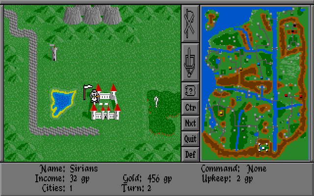

# Warlords Authentic Remake



## About Game

*Warlords* is a turn-based strategy game where eight players, human or computer-controlled, compete to conquer the land of *Illuria*. Players manage cities, armies and heroes to expand their territory and eliminate opponents.

*Warlords* was designed by *Steve Fawkner* and developed by *Strategic Studies Group*. It was released in 1990 for Amiga and MS-DOS.

More detailed information can be found in the [manual](doc/manual.txt).

## About Project

This project is an attempt to develop an authentic remake of the game with original graphics and gameplay compatible with modern platforms.

This is not a source port, the remake is developed from scratch in Java using the original resources. It doesn't use any game engines or third-party libraries.

Initially the remake was developed as a desktop application for Windows, macOS and Linux but was later ported to Android.

The remake has two significant differences from the original game:
* Neutral cities are guarded by a few spearmen of minimal strength.
* The computer-controlled player logic (AI) is based on my own ideas about game strategy.

## Building

### Desktop

SDK requirements: Java 21.

Use the Apache Ant script [build.xml](build.xml) to build the desktop application.

The script builds the executable JAR file `warlords.jar` which can be run with the following command:
```
java -jar warlords.jar
```

### Android

SDK requirements: Android 15 (API level 35) and Java 8 [[#10](../../issues/10)].

Use the Gradle script [build.gradle.kts](android/build.gradle.kts) to build the Android application.

The best way to build and run the Android application is to configure a project in Android Studio or IntelliJ IDEA based on the Gradle scripts.

## Goals
* Publish the game on Google Play.
* Support the network multiplayer game mode.
